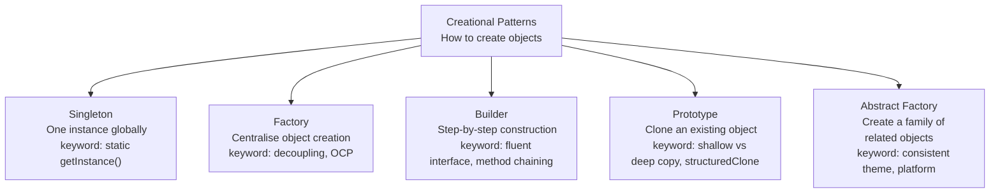
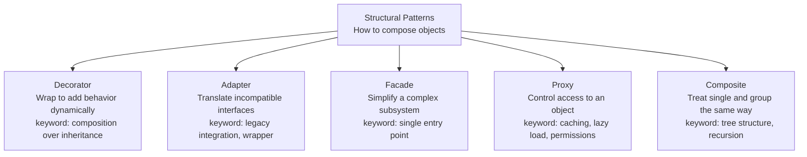
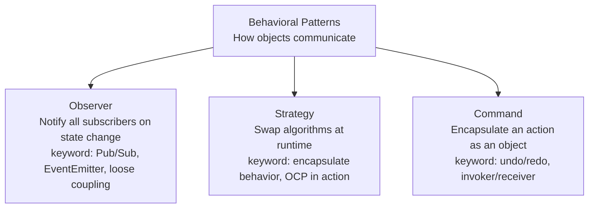

# Design Patterns Sheet

> A visual reference for the 3 categories of Design Patterns, with key interview keywords for each pattern.

---

## 1. Creational Patterns — How to create objects



### When to use each

| Pattern | Use when | Real example |
|---------|----------|--------------|
| **Singleton** | Only one instance should ever exist | Config manager, Logger, DB connection pool |
| **Factory** | Caller should not know which subclass to instantiate | Payment method by region (Alipay, Stripe, PayID) |
| **Builder** | Object has many optional parameters | HTTP request builder, SQL query builder, User profile |
| **Prototype** | New object is very similar to an existing one | Batch spawning enemies in a game |
| **Abstract Factory** | Need a whole set of related objects with consistent style | UI theme (Light / Dark), cross-platform components |

### Singleton — JS example

```js
class AppConfig {
  static #instance = null;
  #settings = { theme: 'light', language: 'en' };

  constructor() {
    if (AppConfig.#instance) return AppConfig.#instance;
    AppConfig.#instance = this;
  }

  static getInstance() {
    if (!AppConfig.#instance) new AppConfig();
    return AppConfig.#instance;
  }

  get(key)        { return this.#settings[key]; }
  set(key, value) { this.#settings[key] = value; }
}

const config1 = AppConfig.getInstance();
const config2 = AppConfig.getInstance();
config1.set('theme', 'dark');
console.log(config2.get('theme')); // → 'dark'  (same instance!)
console.log(config1 === config2);  // → true
```

> **Why `static`?** Without `static`, each object gets its own copy of `#instance` — the guard never triggers. `static` puts `#instance` on the class itself, shared by everyone.

### Factory — JS example

```js
class EmailNotification { send(msg) { console.log(`Email: ${msg}`); } }
class SMSNotification   { send(msg) { console.log(`SMS: ${msg}`); } }
class PushNotification  { send(msg) { console.log(`Push: ${msg}`); } }

class NotificationFactory {
  static create(type) {
    const map = {
      email: EmailNotification,
      sms:   SMSNotification,
      push:  PushNotification,
    };
    const Cls = map[type];
    if (!Cls) throw new Error(`Unknown type: "${type}"`);
    return new Cls();
  }
}

NotificationFactory.create('email').send('Order confirmed!');
// → Email: Order confirmed!

// Adding Slack? Add one class + one line in the map. Nothing else changes.
```

> **Why Factory?** All `new` calls are in one place. Swap a class name, add a type, or change construction logic — only the Factory changes, never the callers.

### Builder — JS example

```js
class UserBuilder {
  constructor(name, email) {
    this.name       = name;
    this.email      = email;
    this.role       = 'user';
    this.isVerified = false;
  }

  setRole(role) { this.role = role; return this; }
  verify()      { this.isVerified = true; return this; }
  setAge(age)   { this.age = age; return this; }

  build() {
    if (!this.name || !this.email) throw new Error('Name and email required');
    return { ...this };
  }
}

// ❌ Without Builder — hard to read, easy to pass args in wrong order
const user = new User('Alice', 'alice@mail.com', 25, null, null, 'admin', true);

// ✅ With Builder — self-documenting, only set what you need
const user = new UserBuilder('Alice', 'alice@mail.com')
  .setAge(25)
  .setRole('admin')
  .verify()
  .build();
```

> **Key mechanic:** Every setter returns `this` (the builder itself), enabling method chaining. `build()` is the only method that returns the final object.

### Prototype — JS example

```js
class Enemy {
  constructor(config) {
    this.type   = config.type;
    this.hp     = config.hp;
    this.loot   = [...config.loot];    // deep copy arrays manually
    this.skills = [...config.skills];
  }

  clone()       { return new Enemy(this); }
  withHp(hp)    { this.hp = hp; return this; }
}

const goblinPrototype = new Enemy({
  type: 'goblin', hp: 100, loot: ['gold'], skills: ['slash'],
});

const weakGoblin = goblinPrototype.clone().withHp(50);
const bossGoblin = goblinPrototype.clone().withHp(500);

bossGoblin.loot.push('sword');
console.log(goblinPrototype.loot); // → ['gold']  prototype is safe ✅
```

> **Shallow vs deep copy:** `{ ...obj }` only copies the top level. Nested arrays/objects still share the same reference — always copy them explicitly with `[...arr]` or `structuredClone()`.

### Abstract Factory — JS example

```js
class LightButton { render() { return '<button style="background:#fff">Click</button>'; } }
class LightInput  { render() { return '<input style="background:#fff"/>'; } }
class DarkButton  { render() { return '<button style="background:#333;color:#fff">Click</button>'; } }
class DarkInput   { render() { return '<input style="background:#333"/>'; } }

class LightThemeFactory {
  createButton() { return new LightButton(); }
  createInput()  { return new LightInput(); }
}

class DarkThemeFactory {
  createButton() { return new DarkButton(); }
  createInput()  { return new DarkInput(); }
}

function buildLoginForm(factory) {
  console.log(factory.createInput().render());
  console.log(factory.createButton().render());
}

buildLoginForm(new DarkThemeFactory());
// Entire form is consistently dark — no mixed styles ✅
```

> **vs plain Factory:** Factory creates one type of object. Abstract Factory creates a *whole family* — Button + Input + Modal all matching the same theme.

---

## 2. Structural Patterns — How to compose objects



### When to use each

| Pattern | Use when | Real example |
|---------|----------|--------------|
| **Decorator** | Need to add features dynamically without subclassing | Coffee + Milk + Syrup + Whip combinations |
| **Adapter** | Two existing interfaces are incompatible | Wrapping an old payment SDK to match a new interface |
| **Facade** | Want to hide a complex subsystem behind a simple API | A `VideoConverter` class that wraps codec, audio, format logic |
| **Proxy** | Need to add caching, logging, or access control around an object | A `CachedImageLoader` that checks cache before fetching |
| **Composite** | Objects form a tree where leaves and branches are treated the same | File system (files and folders), UI component tree |

### Decorator — JS example

```js
class Coffee {
  cost()        { return 3; }
  description() { return 'Basic coffee'; }
}

class MilkDecorator {
  #coffee;
  constructor(coffee) { this.#coffee = coffee; }
  cost()        { return this.#coffee.cost() + 0.5; }
  description() { return this.#coffee.description() + ' + Milk'; }
}

class SyrupDecorator {
  #coffee;
  constructor(coffee) { this.#coffee = coffee; }
  cost()        { return this.#coffee.cost() + 0.7; }
  description() { return this.#coffee.description() + ' + Syrup'; }
}

// Stack decorators like layers — order matters
let order = new Coffee();
order = new MilkDecorator(order);
order = new SyrupDecorator(order);

console.log(order.description()); // → 'Basic coffee + Milk + Syrup'
console.log(order.cost());        // → 4.2
```

> **Why not inheritance?** 3 toppings = 8 subclasses. 5 toppings = 32. Decorator keeps it linear — add one class per topping, combine freely at runtime. This is called avoiding **class explosion**.

### Adapter — JS example

```js
// Old system you cannot change
class OldLogger {
  writeLog(severity, message) {
    console.log(`[${severity}] ${message}`);
  }
}

// New app expects this interface
class NewApp {
  constructor(logger) { this.logger = logger; }
  run() {
    this.logger.log('App started');    // calls .log()
    this.logger.error('Oops!');        // calls .error()
  }
}

// Adapter: wraps old interface, exposes new interface
class LoggerAdapter {
  #old;
  constructor(old) { this.#old = old; }
  log(msg)   { this.#old.writeLog('INFO',  msg); }
  error(msg) { this.#old.writeLog('ERROR', msg); }
}

// NewApp never knows OldLogger exists
const app = new NewApp(new LoggerAdapter(new OldLogger()));
app.run();
// → [INFO] App started
// → [ERROR] Oops!
```

> **Decorator vs Adapter:** Decorator adds behavior (same interface in, same interface out). Adapter translates (different interface in, different interface out). Decorator = add-on. Adapter = plug converter.

### Facade — JS example

```js
// Three complex subsystems
class VideoDecoder  { decode(file) { console.log(`Decoding ${file}`); } }
class AudioMixer    { mix(file)    { console.log(`Mixing audio for ${file}`); } }
class FileExporter  { export(file) { console.log(`Exporting ${file} to MP4`); } }

// Facade: one simple entry point hiding all the complexity
class VideoConverter {
  #decoder  = new VideoDecoder();
  #mixer    = new AudioMixer();
  #exporter = new FileExporter();

  convert(file) {
    this.#decoder.decode(file);
    this.#mixer.mix(file);
    this.#exporter.export(file);
    console.log('Done!');
  }
}

// Caller only needs to know one method
new VideoConverter().convert('movie.avi');
```

> **Key idea:** The subsystems still exist and work independently. Facade just gives callers a simpler door in — it doesn't replace the internals.

### Proxy — JS example

```js
class RealImageLoader {
  load(url) {
    console.log(`Fetching from network: ${url}`);
    return ``;
  }
}

// Proxy: same interface, adds caching transparently
class CachedImageLoader {
  #real  = new RealImageLoader();
  #cache = new Map();

  load(url) {
    if (this.#cache.has(url)) {
      console.log(`Cache hit: ${url}`);
      return this.#cache.get(url);
    }
    const result = this.#real.load(url);
    this.#cache.set(url, result);
    return result;
  }
}

const loader = new CachedImageLoader();
loader.load('photo.jpg'); // → Fetching from network: photo.jpg
loader.load('photo.jpg'); // → Cache hit: photo.jpg  (no network call)
```

> **Common Proxy uses:** caching (shown above), lazy loading (don't create the real object until first use), access control (check permissions before forwarding the call), logging.

### Composite — JS example

```js
// Leaf node — has no children
class File {
  constructor(name, size) { this.name = name; this.size = size; }
  getSize() { return this.size; }
  print(indent = '') { console.log(`${indent}file: ${this.name} (${this.size}kb)`); }
}

// Composite node — can contain leaves or other composites
class Folder {
  #name; #children = [];
  constructor(name) { this.#name = name; }

  add(item)    { this.#children.push(item); return this; }
  getSize()    { return this.#children.reduce((sum, c) => sum + c.getSize(), 0); }
  print(indent = '') {
    console.log(`${indent}folder: ${this.#name}`);
    this.#children.forEach(c => c.print(indent + '  '));
  }
}

// Build a tree — callers treat File and Folder the same way
const root = new Folder('root');
const src  = new Folder('src');
src.add(new File('index.js', 12)).add(new File('app.js', 34));
root.add(src).add(new File('README.md', 2));

root.print();
// folder: root
//   folder: src
//     file: index.js (12kb)
//     file: app.js (34kb)
//   file: README.md (2kb)

console.log(root.getSize()); // → 48
```

> **Key idea:** Both `File` and `Folder` implement `getSize()` and `print()`. Code that calls these methods doesn't need to know if it's dealing with a single file or an entire directory tree.

---

## 3. Behavioral Patterns — How objects communicate



### When to use each

| Pattern | Use when | Real example |
|---------|----------|--------------|
| **Observer** | Multiple parts of the app need to react to the same event | Order status update → notify SMS, kitchen display, analytics |
| **Strategy** | Algorithm or behavior needs to be swappable at runtime | Discount strategies (percentage, flat, BOGO) in a shopping cart |
| **Command** | Actions need to be undoable, queued, or logged | Text editor undo/redo, task queue, macro recorder |

### Observer — JS example

```js
class EventEmitter {
  #listeners = {};

  on(event, fn)   { (this.#listeners[event] ??= []).push(fn); return this; }
  off(event, fn)  { this.#listeners[event] = (this.#listeners[event] ?? []).filter(f => f !== fn); }
  emit(event, data) { (this.#listeners[event] ?? []).forEach(fn => fn(data)); }
}

class OrderService extends EventEmitter {
  #status = 'pending';

  updateStatus(newStatus) {
    this.#status = newStatus;
    this.emit('statusChanged', { status: newStatus, at: new Date() });
  }
}

const order = new OrderService();

// Each module subscribes independently — OrderService knows none of them
order.on('statusChanged', ({ status }) =>
  console.log(`SMS: order is now "${status}"`)
);
order.on('statusChanged', ({ status }) =>
  console.log(`Kitchen screen: ${status}`)
);

order.updateStatus('preparing');
// → SMS: order is now "preparing"
// → Kitchen screen: preparing
```

> **Why loose coupling?** `OrderService` has zero references to `SMSService` or `KitchenDisplay`. Add a new subscriber? Just call `.on()`. Remove one? Call `.off()`. `OrderService` never changes.

### Strategy — JS example

```js
class PercentageDiscount {
  constructor(pct) { this.pct = pct; }
  apply(price) { return price * (1 - this.pct / 100); }
  label()      { return `${this.pct}% off`; }
}

class FlatDiscount {
  constructor(amount) { this.amount = amount; }
  apply(price) { return Math.max(0, price - this.amount); }
  label()      { return `$${this.amount} off`; }
}

class NoDiscount {
  apply(price) { return price; }
  label()      { return 'No discount'; }
}

// Context — holds a strategy, doesn't care which one
class ShoppingCart {
  #discount;
  constructor(strategy = new NoDiscount()) { this.#discount = strategy; }

  setDiscount(strategy) { this.#discount = strategy; }

  checkout(price) {
    const final = this.#discount.apply(price);
    console.log(`${this.#discount.label()}: $${price} → $${final.toFixed(2)}`);
  }
}

const cart = new ShoppingCart();
cart.checkout(100);                              // → No discount: $100 → $100.00

cart.setDiscount(new PercentageDiscount(20));
cart.checkout(100);                              // → 20% off: $100 → $80.00

cart.setDiscount(new FlatDiscount(15));
cart.checkout(100);                              // → $15 off: $100 → $85.00
```

> **Connection to OCP:** Adding a new discount type = add a new class. The `ShoppingCart` context never changes. Strategy is OCP in action.

### Command — JS example

```js
// Receiver: the object that actually does the work
class TextEditor {
  #content = '';
  getContent()      { return this.#content; }
  insert(text)      { this.#content += text; }
  delete(charCount) { this.#content = this.#content.slice(0, -charCount); }
}

// Concrete commands — each knows how to execute AND undo itself
class InsertCommand {
  constructor(editor, text) { this.editor = editor; this.text = text; }
  execute() { this.editor.insert(this.text); }
  undo()    { this.editor.delete(this.text.length); }
}

// Invoker: manages history, calls execute/undo
class CommandManager {
  #history   = [];
  #redoStack = [];

  execute(cmd) {
    cmd.execute();
    this.#history.push(cmd);
    this.#redoStack = [];
  }

  undo() {
    const cmd = this.#history.pop();
    if (!cmd) return;
    cmd.undo();
    this.#redoStack.push(cmd);
  }

  redo() {
    const cmd = this.#redoStack.pop();
    if (!cmd) return;
    cmd.execute();
    this.#history.push(cmd);
  }
}

const editor  = new TextEditor();
const manager = new CommandManager();

manager.execute(new InsertCommand(editor, 'Hello'));
manager.execute(new InsertCommand(editor, ' World'));
console.log(editor.getContent()); // → 'Hello World'

manager.undo();
console.log(editor.getContent()); // → 'Hello'

manager.redo();
console.log(editor.getContent()); // → 'Hello World'
```

> **Three roles to remember:** Receiver (does the work — `TextEditor`), Command (wraps one action + its undo — `InsertCommand`), Invoker (manages history — `CommandManager`). The Invoker never knows what the command actually does.

---

## One-line interview answers

| Pattern | One-line answer |
|---------|----------------|
| Singleton | *"Ensures a class has only one instance and provides a global access point to it."* |
| Factory | *"Centralises object creation so callers don't need to know which concrete class to instantiate."* |
| Builder | *"Constructs a complex object step by step using a fluent interface, avoiding telescoping constructors."* |
| Prototype | *"Creates new objects by cloning an existing one, which is faster than constructing from scratch."* |
| Abstract Factory | *"Produces families of related objects without specifying their concrete classes."* |
| Decorator | *"Dynamically adds behavior to an object by wrapping it, as an alternative to subclassing."* |
| Adapter | *"Converts one interface into another that a client expects, enabling incompatible classes to work together."* |
| Observer | *"Defines a one-to-many dependency so that when one object changes state, all dependents are notified automatically."* |
| Strategy | *"Defines a family of algorithms, encapsulates each one, and makes them interchangeable at runtime."* |
| Command | *"Encapsulates a request as an object, enabling undo/redo, queuing, and logging of operations."* |
